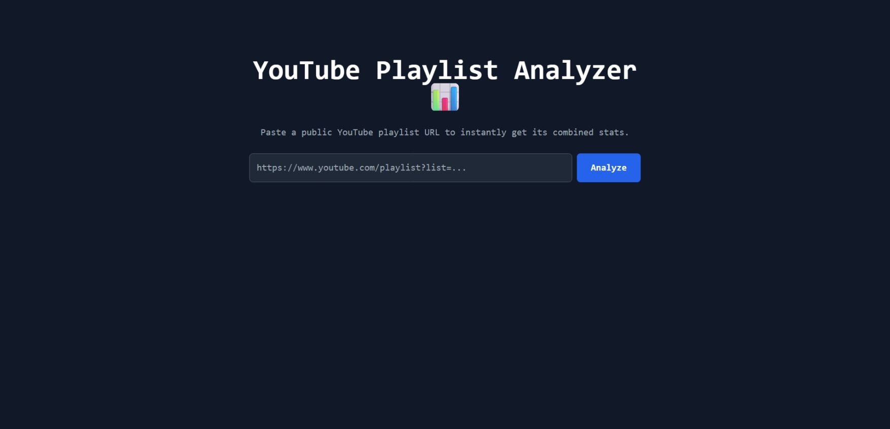
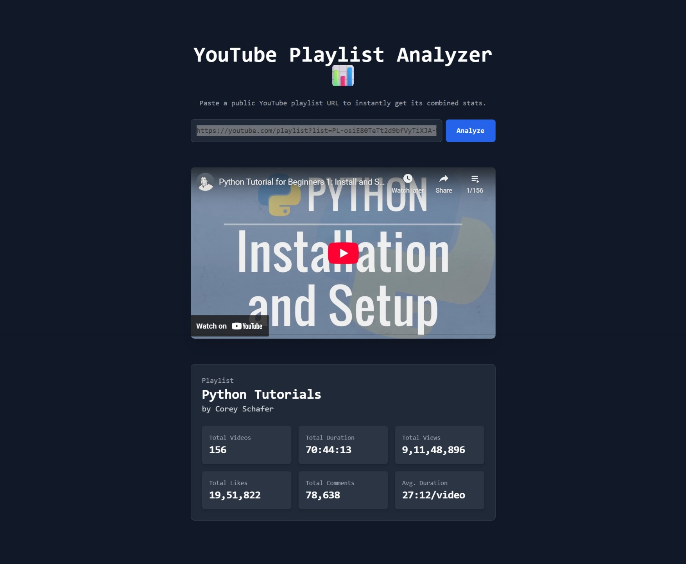

# YouTube Playlist Analyzer

A web application that analyzes YouTube playlists and provides detailed statistics including total duration, view counts, and other metrics.

## Features

- 🎵 Analyze any public YouTube playlist
- ⏱️ Calculate total watch time
- 📊 View statistics for each video
- 📈 See playlist metrics (views, likes, comments)
- 🎨 Clean, responsive UI built with Next.js 13
- 🚀 Fast server-side processing

## Tech Stack

- Next.js 13 (App Router)
- TypeScript
- Tailwind CSS
- YouTube Data API v3
- Vercel (Deployment)

## Getting Started

### Prerequisites

- Node.js 16.8 or later
- YouTube Data API key ([Get one here](https://console.cloud.google.com/apis/library/youtube.googleapis.com))

### Installation

1. Clone the repository:
```bash
git clone https://github.com/yourusername/youtube-playlist-stats.git
cd youtube-playlist-stats
```

2. Install dependencies:
```bash
npm install
```

3. Create a `.env.local` file in the root directory:
```env
YOUTUBE_API_KEY=your_youtube_api_key_here
```

4. Start the development server:
```bash
npm run dev
```

5. Open [http://localhost:3000](http://localhost:3000) in your browser.

## Screenshots

### Home Page

*Landing page with playlist URL input*

### Analysis Results

*Detailed playlist statistics and metrics*

## Usage

1. Copy a YouTube playlist URL (must be public)
2. Paste the URL into the input field
3. Click "Analyze" to see detailed statistics

## API Rate Limits

The application includes built-in rate limiting to prevent API quota exhaustion. Each IP address is limited to one request per second.

## Deployment

The easiest way to deploy this application is using Vercel:

1. Push your code to GitHub
2. Import your repository in Vercel
3. Add your `YOUTUBE_API_KEY` in the Environment Variables section
4. Deploy

## Contributing

1. Fork the repository
2. Create your feature branch (`git checkout -b feature/amazing-feature`)
3. Commit your changes (`git commit -m 'Add some amazing feature'`)
4. Push to the branch (`git push origin feature/amazing-feature`)
5. Open a Pull Request

## License

This project is licensed under the MIT License - see the LICENSE file for details.

## Acknowledgments

- YouTube Data API
- Next.js team
- Vercel for hosting

## Support

If you encounter any issues or have questions, please open an issue in the GitHub repository.
